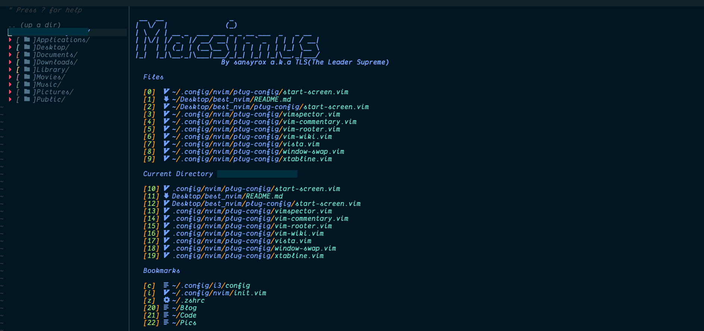

# Macsimus

<!-- Place this tag where you want the button to render. -->

It is highly modified version of neovim optimised for the most productive workflow.

## ScreenShots



## Demo Video

Coming Soon

## Why the name?

I am glad you asked. Macsimus = e(macs) + v(im) + us.
The editor takes inspiration from the best features of emacs and vim and is made for us.

## Install in one command

The following will install this config if you have an existing config it will move it to `~/.config/nvim.old`

This script only supports Mac, Ubuntu and Arch

```
bash <(curl -s https://raw.githubusercontent.com/sansyrox/macsimus/main/utils/install.sh)
```

## Install Neovim

- Mac

  ```
  brew install --HEAD neovim # Nightly version

  brew upgrade neovim --fetch-HEAD # Sometimes you need to update
  ```

- Ubuntu

  Option 1
  ```
  sudo add-apt-repository ppa:neovim-ppa/unstable
  sudo apt-get update
  sudo apt-get install neovim
  ```
  
  Option 2
  ```
  curl -LO https://github.com/neovim/neovim/releases/latest/download/nvim.appimage -o /tmp/nvim.appimage

  sudo mv /tmp/nvim.appimage /usr/local/bin/nvim

  chmod +x /usr/local/bin/nvim
  ```

- Arch

  ```
  yay -S neovim-git # Latest
  ```

## Clone this repo into your config

```
git clone https://github.com/sansyrox/macsimus.git ~/.config/nvim
```

## Install python & node support

```
pip install pynvim
```

```
npm i -g neovim
```

## Install Neovim remote

```
pip install neovim-remote
```

This will install `nvr` to `~/.local/bin` so you will need to add the following to your `bashrc` or `zshrc`

```
export PATH=$HOME/.local/bin:$PATH
```

## Install clipboard support

- On Mac pbcopy should be builtin

- Ubuntu

  ```
  sudo apt install xsel
  ```

- Arch

  ```
  sudo pacman -S xsel
  ```

## (Optional) Install python & node support using virtual environments

Make sure to add these paths somewhere in your config

```
let g:python3_host_prog = expand("<path to python with pynvim installed>")
let g:python3_host_prog = expand("~/.miniconda/envs/neovim/bin/python3.8") " <- example

let g:node_host_prog = expand("<path to node with neovim installed>")
let g:node_host_prog = expand("~/.nvm/versions/node/v12.16.1/bin/neovim-node-host") " <- example
```

## List of programs you should install

- ranger
- ueberzug
- ripgrep
- lazy git
- lazy docker

Explanations and installation instruction can be found on my blog

## Language Servers

Since CoC doesn't support all languages in there extensions
I recommend installing some language servers from scratch
and adding them to your `coc-settings.json` file

Example:

- bash

  `npm i -g bash-language-server`

  ```
  "languageserver": {
  "bash": {
    "command": "bash-language-server",
    "args": ["start"],
    "filetypes": ["sh"],
    "ignoredRootPaths": ["~"]
    }
  }
  ```

## For FAR to work

```
:UpdateRemotePlugins
```

## TabNine

To use TabNine enter the following in a buffer:

```
TabNine::config
```

**NOTE** This extension can take up a ton of memory

## Vim Gists

To use **vim-gists** you will need to configure the following:

```
git config --global github.user <username>
```

## Font To Use

I use a custom NERD Patched DankMono Font. But if that is a little expensive for you, FiraCode also works well with the theme.

## ToDo

- Try integrating Telescope.nvim

## Common Issues

If markdown preview is not working, try doing `:call mkdp#util#install()`

## Contributing Guidelines

This project is a very contribution friendly project. All sorts of contributions are public and are licenced under GPL3 licence.
Being said that, I am announcing myself as the T.L.S(The Leader Supreme) of this project.

### What does that mean?

I am open to all kinds of discussions but I hold the veto to block/stop them when I feel like they are not adding any value.

### Why not a democratic approach(like all my other OSS projects)?

Since this project is very deep integrated with my work flow, I will not accept any request that makes this project slower or makes it even a little unusable for me.
However, if you think that there is something that will improve this project feel free to open a PR without any hesitation.

### What if someone does not agree with this approach?

Read this [line](https://github.com/sansyrox/macsimus#what-does-that-mean) again :)

I hope you all enjoy the project. Show some appreciation by
<a class="github-button" href="https://github.com/sansyrox/macsimus" data-icon="octicon-star" aria-label="Star sansyrox/macsimus on GitHub">starring ⭐</a> the project?
